【【GeekHour】一小时Git教程】 https://www.bilibili.com/video/BV1HM411377j/?p=2&share_source=copy_web&vd_source=dd23e37f34be8abeabaf405e07d31ab0


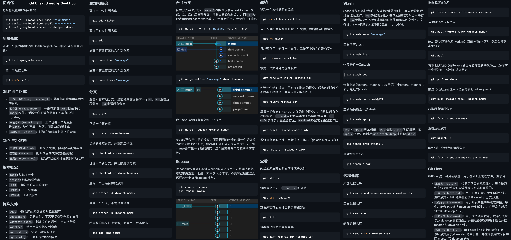

# 初始化配置

- 先配置名字和邮箱，只有配置了这个才知道以后提交内容是谁提交的
  ```shell
  git config --global user.name "ymr"
  git config --global user.email yuanxin10821@gmail.com
  ```
	- 这里的参数：
		- `--local` 可以省略，默认就是这个。本地配置，仅对当前仓库生效
		- `--global` 全局配置，对所有仓库生效
		- `--system` 系统配置，对所有用户生效

- 还可以用下面命令保存用户名和密码，这样就不用每次都输入了：
	```shell
	git config --global credential.helper store
	```

- 查看配置
	```shell
	git config --global --list 
	```

- 把主分支设置成 main , 之前的默认主分支是master
	```shell
	git config --global init.defaultbranch main
	```
	(不设置也行，不影响使用，就是可能其他人看了有点别扭)

- 设置git默认编辑器(写commit message的时候可能会用上)

  ```shell
  git config --global core.editor nvim
  ```

<br>


# 新建仓库(版本库)

版本库又叫仓库，英文名 Repository 简称 Repo

可以把仓库理解为一个目录，这个目录内的所有的文件都可以被git管理起来，每个文件的修改、删除、添加等操作，Git都能跟踪到，以便于任何时候都能追踪历史或者还原到之前的某一个版本。


创建一个目录很简单，只需要把该目录变成git可以管理的仓库就可以了：

- 直接在本地创建一个仓库：

  ```shell
  git init
  ```

  这个时候应该在目录下会有一个 `.git` 目录即创建成功了。这个 `.git` 目录包含了git 管理该仓库所需的所有数据，不得随意修改，否则可能会导致数据丢失。

- clone一个仓库：

  ```shell
  git clone <URL>
  ```

<br>

# 工作区域和文件状态

git 的本地数据管理分为三个区域：

- **工作区** (working directory)  （`.git` 所在的目录）

  就是我们电脑上的本地目录。

- **暂存区** (staging area/index)  （`.git/index`）

  是一个临时存储区域，用于保存即将提交到Git仓库的修改的内容。暂存区是git在进行版本控制的时候非常重要的一个区域。

- **本地仓库** (local repository)  (`.git/object`)

  就是使用 `git init` 创建的那个，它包含了完整的项目历史和元数据，是git存储代码和版本信息的主要位置。

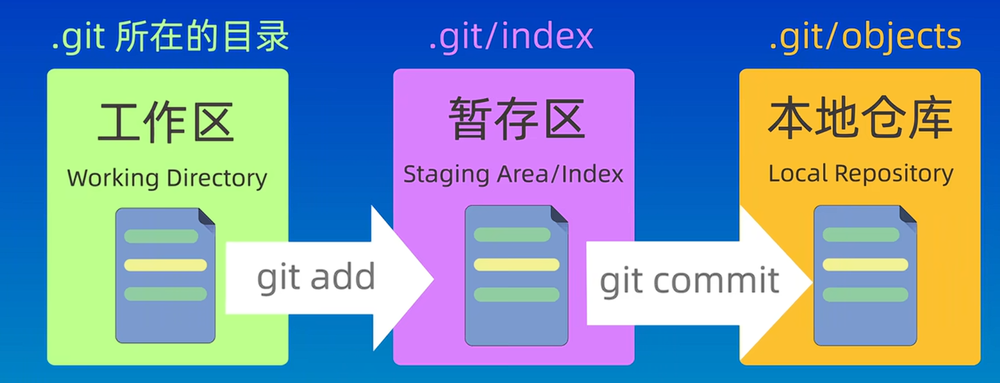

<br>

当你修改完工作区的文件之后，需要将其添加到暂存区，然后再将暂存区的内容提交到本地仓库中。如上图所示。而在这个过程中，我们可以使用git提供的命令来进行 **查看、比较或者撤销修改**  来保证版本控制的准确性和完整性。

<br>

相应地，在git管理下的文件有4个状态：

- 未跟踪 (Untrack)

  即未被git管理的文件

- 未修改 (Unmodified)

  已经被git管理起来，但是文件的内容未发生变化

- 已暂存 (Modified)

  就是已经修改了的文件，但是还没有添加到暂存区

- 已提交 (Staged)

  修改之后并且被添加到暂存区内的文件

  - 可以使用 `git ls-files` 查看暂存区内的文件

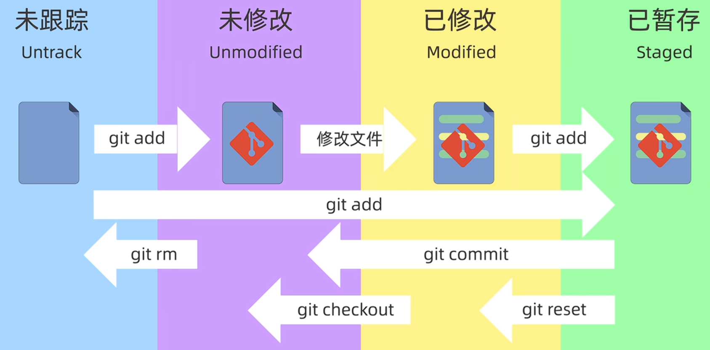

<br>

# 添加和提交文件

```shell
git init   # 创建仓库
git status  # 查看仓库状态
git add  # 添加到暂存区
git commit  # 提交
```


- **git status**  查看仓库状态

  比如当前正处于哪个分支、有哪些文件、以及这些文件目前处于那些状态。

- **git add** 添加文件到暂存区

  - 可以使用通配符来一次性添加多个文件。 

    ```shell
    git add *.txt
    ```

  - add 命令可以接受文件夹作为参数，表示添加该文件夹下所有文件。

    ```shell
    git add .
    ```

- **git commit** 将暂存区的文件提交到本地仓库

  - 可以使用 `-m` 参数顺道附上提交信息，如 `git commit -m "第一次提交"` 。要是不适用该参数，就会进入一个交互式界面，即打开git指定的编辑器来输入提交信息。
  - git 在提交的时候只会提交暂存区中的文件，而不会提交工作区中的其它文件。
  - 可以加上 `-a` 参数，直接添加暂存并提交，一步到位！

- 提交完成之后，可以使用 **git log** 命令来查看提交记录
  
  - `git log --oneline` 查看简洁的提交记录

<br>


# git reset 回退版本

在日常开发的时候，我们经常需要撤销之前的一些修改内容，或者回退到之前的某一个版本。这个时候就要使用 `git reset` 命令了。

**git reset 用于回退版本，可以退回到之前的某一个提交的状态**。

`git reset` 有三种模式：

- **`git reset --soft`**

  回退到某一个版本，并且保留工作区和暂存区的所有修改内容。

  ```shell
  git reset --soft HEAD^  #回退到HEAD指针指向的上一个版本（通常是当前版本的上一个版本）
                                        #HEAD是一个指向分支的最新提交结点的指针
  git reset --soft HEAD~  #和上一个命令等价
  git reset --soft HEAD^2  #当前提交版本的前两个提交版本
  ```

- **`git reset --hard`** （比较危险，慎用）

  回退到某一个版本，但是丢弃工作区和暂存区的所有修改内容。

  ```shell
  git reset --hard <commit-id>  # 回退到指定的版本
  ```

- **`git reset --mixed`**

  介于 soft 和 hard 之间，回退到某一个版本，只保留工作区的修改内容，但是丢弃暂存区的修改内容。**--mixed 也是git reset 的默认参数**。


有的时候，可能就是一不小心就用`git reset --hard`了，导致当前工作区和暂存区的数据丢失。但是不要紧，git只要是commit过的都是可回溯的。（没commit过的就不一定了）

这个时候可以使用 **`git reflog`** 来查看我们的操作的历史记录，找到误操作之前的版本号，然后再用 `git reset` 命令来回退到这个版本就可以了。


- 取消修改

  在没提交之前，可能我们不想要这一次的修改，我们想要重新得到暂存区的内容，可以使用如下命令：

  ```shell
  git restore <file>
  ```

  

<br>

# git diff 查看差异

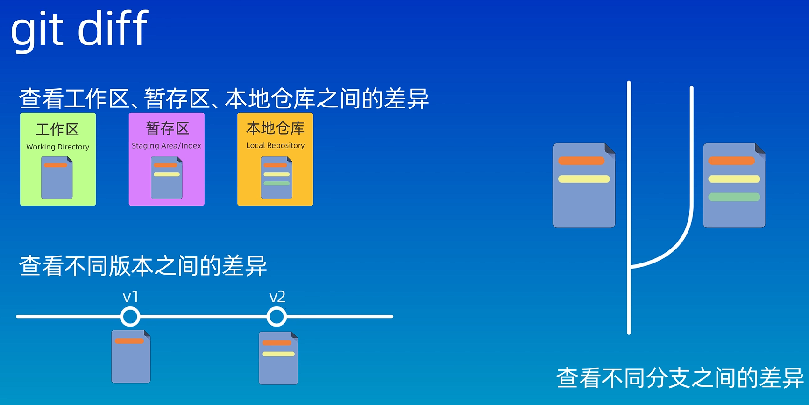


**`git diff`** 可以：

- 查看 工作区、暂存区、本地仓库之间差异

  - 若 `git diff` 不加任何参数，则默认比较的是工作区和暂存区之间的差异内容。会显示更改的文件以及更改的详细信息。

  - 比较暂存区和版本库之间的差异：

    ```shell
    git diff --cached  # 与最近一次提交的比较
    git diff --cached <commit-id>  # 与特定版本比较
    ```

  - 也可以只比较特定文件的差异

    ```shell
    git diff text.txt   # 比较工作区和暂存区的text.txt的内容有哪些不一样
    ```

    

- 查看不同版本之间的差异

  ```shell
  git diff <commit-id1> <commit-id2>
  ```

- 查看不同分支之间的差异

  ```shell
  git diff <branch-name1> <branch-name2>
  ```

- 比较两个不同分支的文件

  ```shell
  git diff <branch-name1>:<file-name> <branch-name2>:<file-name>
  ```

<br>


# 如何从版本库中删除文件

删除文件有两种方法：

- 直接删除文件，然后提交

  以删除 test.txt 为例：

  ```shell
  rm -rf test.txt
  git add *
  git commit -m "delete test.txt"
  ```

- 使用 **`git rm`**

  以删除 test.txt 为例：

  ```shell
  git rm test.txt  #效果等价于第一种方法的前两条命令
  git commit -m "delete test.txt"
  ```

  - `git rm <file> ` 把文件从工作区和暂存区同时删除
  - `git rm --cached <file> ` 把文件从暂存区删除，但是保留工作区中的内容
  - `git rm -r * ` 递归删除某个目录下的所有文件及其子目录下所有文件
  - 删除后要想保留到版本库，就不要忘记提交

<br>


# .gitignore 忽略文件

.gitignore 文件是git中的一个特殊的文件，其作用就是忽略掉一些不该被加入到版本库中的一些文件，如此可以让我们的版本库变得干净又卫生。

**工程目录下的 `.gitignore` 文件本身也会被 Git 管理**，除非它们自己被其他的 `.gitignore` 规则所忽略。

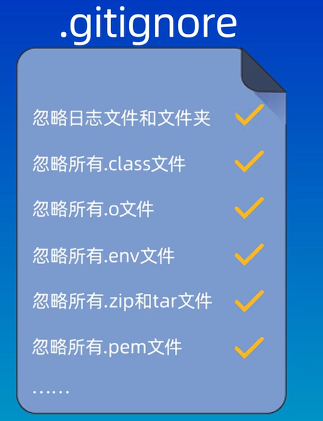

那么，**哪些文件是不应该被纳入到版本库中的呢？** 一般我们遵循下面几个原则

- 系统或软件自动生成的文件
- 编译产生的中间文件和结果文件
- 系统运行时生成的日志文件、缓存文件、临时文件
- **涉及身份、口令、密码、密钥等敏感信息的文件**

<br>

.gitignore 文件的规则也很简单，直接在该文件中列出需要忽略的 **文件模式**（file pattern）即可。与.gitignore中列出的文件模式匹配的文件就不会被添加到版本库中，也不会被git追踪和管理，git会把他们当成空气。

但是若有与.gitignore中的文件模式相匹配的文件，比如 test.log ，但是在写.gitignore之前，test.log 就已经被添加到版本库中的了，这个时候git就是还会自动追踪管理 test.log 。就是说.gitignore生效的前提就是该文件没有被添加到版本库中。这个时候只需要使用 `git rm --cached` 一下就又好用 了。

还有就是默认空文件夹也不会纳入版本控制之中。


- .gitignore文件的匹配规则

  - 从上到下逐行匹配，每一行表示一个忽略模式

  - 详细规则在[官网](https://git-scm.com/docs/gitignore)上有详细说明

    - 空行或#开头的会被git忽略，#即注释

    - 使用标准的Blob模式匹配（Blob模式即shell所使用的简化的正则表达式）：

      - `*` 匹配任意个字符

      - `?` 匹配单个字符

      - `[]` 匹配列表中的单个字符

        - `[abc]` 匹配 a、b、c 三者之一
        - `[0-9]` 匹配 0、1、2……9 的任意一个数值
        - `[a-z]` 匹配任意小写字母

      - `**` 匹配任意的中间目录

      - `!` 表示取反，即忽略模式以外的文件或者目录

        ```shell
        # 忽略掉所有的 .a 文件
        *.a
        
        # 但是保留 lib.a
        !lib.a
        
        # 只忽略当前目录下的 TODO 文件，不忽略子文件夹下的 TODO 文件
        /TODO   # / 表示当前git仓库的根目录
        
        # 忽略所有目录下名为的 build 文件夹
        build/
        
        # 忽略 doc 文件夹下的 .txt 文件，但是不会胡忽略其子文件夹下的 .txt
        doc/*.txt
        
        # 忽略 doc 文件夹及其子目录下的所有 pdf 文件
        doc/**/*.pdf
        ```

      - 在 Github 上有各种常用语言的忽略模板，新建仓库的时候我们可以直接使用，也可以根据自己需要进行修改
  
- **多 `.gitignore` 文件的工作机制**

  - **作用域规则**

    每个 `.gitignore` 文件只对它所在的目录及其子目录有效：

    ```shell
    my-project/
    ├── .gitignore           # 作用于整个项目
    ├── src/
    │   ├── .gitignore       # 只作用于 src/ 目录及其子目录
    │   └── main.js
    ├── tests/
    │   ├── .gitignore       # 只作用于 tests/ 目录及其子目录
    │   └── test.js
    └── docs/
        └── README.md
    ```

  - **优先级顺序**

    **子目录的 `.gitignore` 文件优先级更高**：
    1. 首先应用项目根目录的 `.gitignore`
    2. 然后应用子目录的 `.gitignore`（会覆盖父目录的规则）

    ```bash
    # 根目录 .gitignore
    *.log        # 忽略所有 .log 文件
    test/        # 忽略 test 目录
    
    # src/.gitignore
    !debug.log   # 不忽略 src/ 下的 debug.log
    ```

    结果：
    - `app.log` → 被忽略
    - `src/app.log` → 被忽略
    - `src/debug.log` → **不被忽略**（子目录规则覆盖了父目录规则）

  - **规则继承与覆盖**

    - 子目录的规则会**添加或修改**父目录的规则
    - Git 会**从根目录向下逐层**应用规则
    - 后面的规则（子目录）可以覆盖前面的规则（父目录）

- 全局 `.gitignore` 文件**

  除了项目内的 `.gitignore`，Git 还支持全局配置：

```bash
# 设置全局忽略文件
git config --global core.excludesfile ~/.gitignore_global
```

​	**执行顺序**：
​    1. 项目根目录 `.gitignore`
​       2. 子目录 `.gitignore`
​       3. 全局 `.gitignore`

- **推荐的结构**

  ```shell
  project/
  ├── .gitignore              # 项目通用规则
  ├── src/
  │   └── .gitignore         # 源代码特定规则
  ├── tests/
  │   └── .gitignore         # 测试文件特定规则
  ├── docs/
  │   └── .gitignore         # 文档相关规则
  └── build/                  # 这个目录通常被忽略
  ```

<br>


# SSH配置和克隆仓库

远程库，这里目前可以理解未QQ空间或者微信朋友圈，就是把你的项目传到云端，由第三方平台接管。


我们可以先在Github上创建一个仓库，创建完成后，就跳到了仓库的主页面，如下图所示：

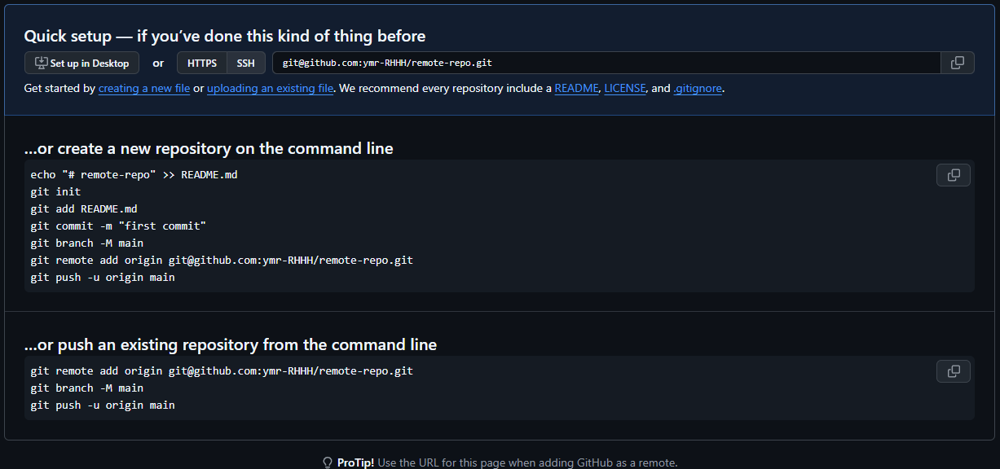


可见，这里Github给了我们一些提示，让我知道了如何把本地库和远程库关联起来:

- 第一个方法时本地如果没有仓库，可以现在本地建个仓库，然后按照方法一的命令将远程库关联起来
- 第二个方法就是本地有仓库的话要怎么操作。


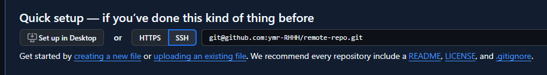

如上图所示，这里有两种远程仓库地址的方式：

- **HTTPS** 

  把本地push到远程库的时候，需要验证用户名和密码

- **SSH** 

  推送的时候不需要验证用户名和密码，但是需要在Github上添加SSH公钥配置。

  - 更推荐这种方式，更加安全方便。

  - 将刚才的仓库clone到本地，但是失败了，这就是SSH公钥没配置导致的，使用SSH方式必须配置SSH密钥。

    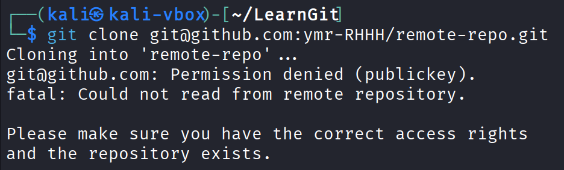

  - SSH密钥配置方法：

    1. 回到家目录，进入 `.ssh` 目录

       ```shell
       cd ~/.ssh
       ```

    2. 使用ssh-keygen 生成密钥

       ```shell
       ssh-keygen -t rsa -b 4096
       ```

       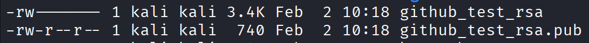

       然后就生成了俩文件，这俩文件自己留好，谁都别给。

       - 没有任何扩展名的 `github_test_rsa` 文件是 **私钥文件**
       - 另一个有扩展名的 `github_test_rsa.pub` 文件是 **公钥文件** 

       这里打开公钥文件，然后复制公钥文件的内容，回到GitHub页面，点击右上角头像->settings-> SSH and GPG keys 

       然后复制粘贴，如下图所示：

       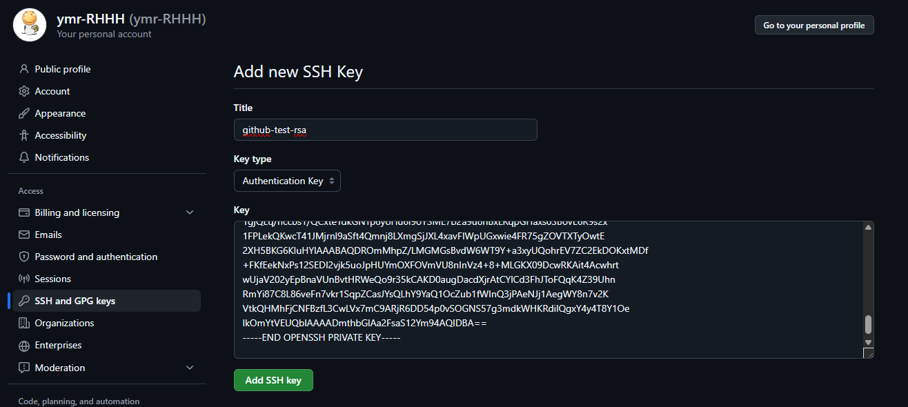

       如此就成功的把公钥添加到github上了。

       

       创建一个config文件，添加如下内容，使得我们以后访问GitHub的时候使用指定的密钥进行访问。

       ```shell
       # Github
       Host github.com
       HostName github.com
       PreferredAuthentications publickey  
       IdentityFile ~/.ssh/github_test_rsa
       ```

       然后再clone就成功了：

       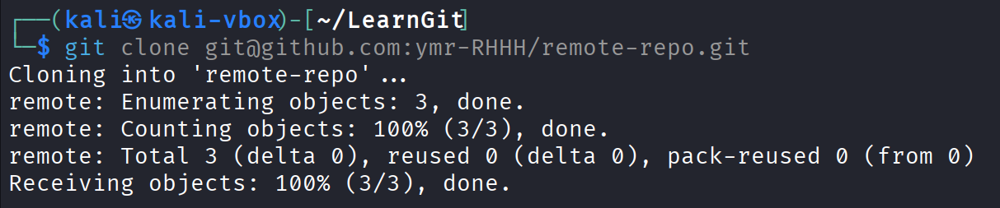

<br>


仓库克隆到本地之后，本地库和远程库其实是两个库，在本地库做的任何操作不会对远程库有任何影响，远程库对本地库亦复如是，他们之间是相互独立的。

因此我们需要一种机制来同步本地仓库和远程仓库的修改内容，让他们的状态保持一致。这个同步的过程就涉及到了git的两个命令:

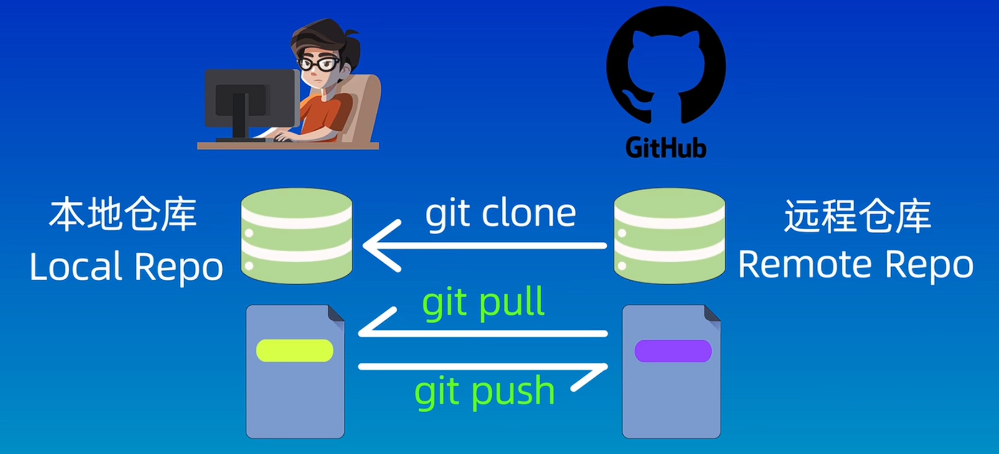


- **`git pull`**

  把远程仓库的修改拉取到本地库

- **`git push`**

  把本地库的修改推送给远程库


**总结**：

- 克隆仓库：

  `git clone <repo-address>`

- 推送更新内容：

  `git push <remote> <branch>`

- 拉取更新内容：

  `git pull <remote>`

<br>


# 关联本地仓库和远程仓库

 上节课我们学习了创建一个远程库并将其克隆到本地。

那么如果我们本地已经有了一个仓库，那么我们如何将其放在远程库中呢？


答案还是先在Github上建一个远程库。

然后具体操作步骤其实GitHub已经给提示了：

```shell
echo "# firstRemote" >> README.md
git init
git add README.md
git commit -m "first commit"
git branch -M main
git remote add origin git@github.com:ymr-RHHH/firstRemote.git
git push -u origin main  
```


在这里 `git remote add origin git@github.com:ymr-RHHH/firstRemote.git` 这个命令就是把本地仓库和远程库关联起来的命令。

- **`git remote add <shortname> <url>`**

  添加一个远程仓库。

  `git remote add origin git@github.com:ymr-RHHH/firstRemote.git`

  这里的 origin 就是我们远程仓库的别名，一般情况下默认的别名都是这个，当然我们也可以自己指定一个名字。

- **`git remote -v`**

  查看当前仓库对应远程库的别名和地址。

  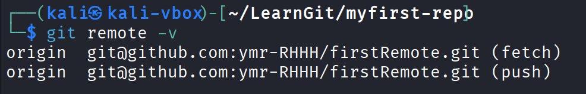

- **`git push -u origin main`**

  将本地的main分支和远程的origin仓库的main分支关联起来。

  其实这个命令的全称应该这么写 `git push -u origin main:main` ，这里 `-u` 是 upstream 的缩写。由于这里的分支名相同，所以就写一个 main 就行。

  所以这里就是把本地main分支的内容推到 origin 的 main 分支上


在关联完成之后，可以修改远程库（比如有其他人修改了这个远程库），这个时候我们就需要使用 `git pull` 命令来拉取远程库更行的内容。

- **`git pull <remote-repo> <remote-branch>:<local-branch>`**

  `git pull` 命令一般也要加上仓库名和分支名，这里仓库名和分支名可以省略，省略的话默认拉取 origin 的 main 分支。

  这个命令的作用就是 **把远程仓库的指定分支拉取到本地再进行合并** 。

  - 执行 `git pull` 的时候要注意，在执行完  `git pull` 之后，git 会自动为我们进行一次合并操作（如果远程库和本地库的修改内容没有冲突的话，那么合并操作就会成功，否则就会因为冲突而失败，这个时候就需要手动解决一下冲突）

- **`git fetch`**

  除此以外，我们还可以使用 `git fetch` 命令来来拉取远程库的内容。和 `git pull` 的区别就在于 fetch 仅获取远程库的修改，但是 **并不会自动合并到本地仓库中，而是需要我们手动合并** 。 

（分支合并冲突怎么解决这个问题留到后面学分支的时候再解决）

<br>

# 分支简介和基本操作

分支（Branch）是git中非常重要的一个功能，可以将其看作是代码库的不同版本，可以独立存在，并且有自己的提交记录。

分支非常适合团队协作和开发管理。比如多个开发人员可以在自己的分支上独立工作，最后再合并到主线代码库中。我们也可以在一个分支上进行新功能开发，或者建立一个问题修复的分支来处理一些Bug和缺陷。如此，可以让主线代码仓库保持一个随时可用的比较稳定的状态，而不影响到其它功能的开发和测试，保证了项目的正常运行和高效协作。


分支的优点就是能够提高团队协作效率，减少冲突和错误的影响，让团队中的每个人都能够独立开发和测试。

- 创建新的分支

  `git branch <branch-name>` 

  该命令只会新建一个分支，并不会自动切换到新建的分支上

- 查看分支列表

  `git branch` 

  - 查看分支图

    `git log --graph --oneline --decorate -all` 
    
    这个命令太长了，可以使用`alias`命令给它定义个别名
    
    `git config --global alias.graph 'log --graph --oneline --decorate --all'`

- 切换分支

  `git checkout <branch-name>`

  不过这里有个问题，除了切换分支和状态之外，checkout命令还可以用来恢复文件或者目录到之前的某个状态，这个时候如果分支名称和文件名称一样的话就会出现歧义，该命令会**默认切换分支，而不是恢复文件** ，为了避免这种歧义，git官方在2.23版本之后为我们提供了一个新命令

  - **`git switch <branch-name>`** 

    该命令专门用于切换分支。

- 合并分支

  `git merge <merged-branch>`

  \<merged-branch\> 是要被合并的分支，目前所在的分支就是合并后的目标分支。

- 删除分支

  分支被合并之后不会消失，如果不需要这个分支了，可以使用

  `git branch -d <branch-name>`

  来删除分支。（-d表示删除已经合并的分支，但是没有合并的分支不能使用 -d  参数来进行删除）

  - `git branch -D <branch-name>` 强行删除分支，不管它有没有合并


<br>


# 解决合并冲突

一般情况下，如果两个分支的修改内容没有重合的部分的话，那么合并分支就会非常简单，git会自动帮我们完成合并，但要是凉饿分支修改了同一个文件的同一行代码，git就不知道该保留哪个分支的内容了，这个时候就产生了 **冲突**（conflict），这个时候就得手动解决冲突


比如，可以新建一个分支 feat，然后在该分支和主分支里分别加一个文件，文件名也叫feat吧，然后分别将文件内容修改如下：

```txt
# feat on main branch
iiiii

this is main branch

# feat on feat branch
iiiii

this is feat branch
```

然后分别提交，然后合并，然后就可以看到合并失败了：

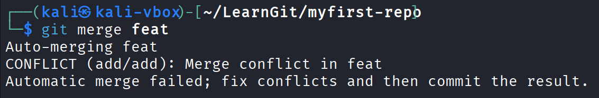

但是这个时候合并并没有退出，此时git还是在进行合并模式，只需要修改冲突内容之后再提交就会完成本次合并。

在这里，可以先用 `git status` 查看冲突文件的列表：

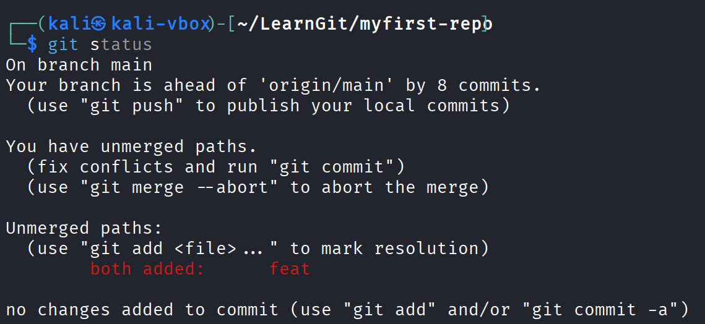


也可以使用 `git diff` 查看冲突文件的具体内容

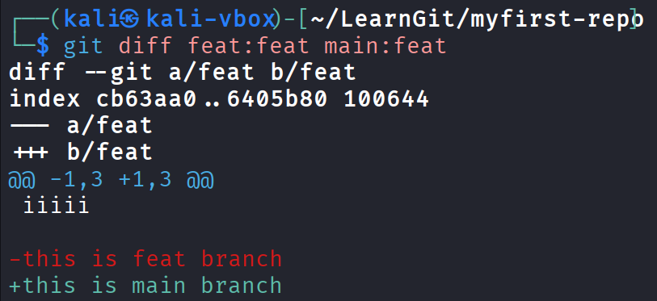

如此，我们就需要手动编辑一下，干掉不想要的，留下想要的，然后再重新提交并合并。

实际上，这个时候直接提交也可以自动完成合并。


要是这个时候不想合并了，可以使用 `git merge --abort` 中止合并。


<br>

# 回退和rebase

在git中，除了merge方法之外，还有rebase方法可以将不同分支的内容整合在一起。

> 在使用`git merge <branch-name>` 之后，会将指定的分支合并到主分支上，然后在主分支上产生一条提交记录。

但是，使用 rebase 就不一定是在 main 分支上进行操作了。我们可以在任意分支上执行 rebase 操作，rebase 就是把其它的指定的分支和当前的分支合并（当前分支可以不是主分支）

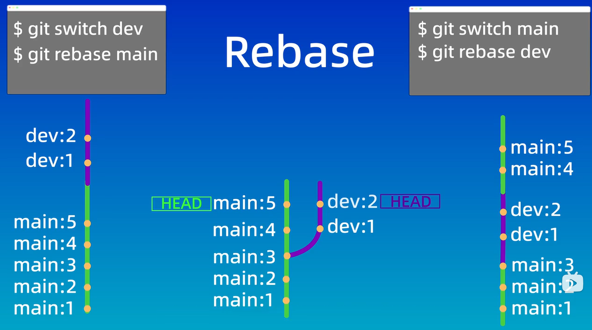

在执行rebase之后，结果都是一个直线，只是其结点的顺序不一样罢了。

在 git 中，每个分支都有一个指针（HEAD）指向当前分支的最新提交记录。在进行 rebase 操作的时候， git 会先找到当前分支和目标分支的共同祖先（图中即 main:3 结点），再把当前分支上从共同祖先到最新提交记录的所有提交。这里就和嫁接一样，从分叉点吧整个分支都移动到目标分支的最新提交记录后面。


**rebase 和 merge 有什么区别？该如何区分使用呢？**

- **merge**

  - 优点：

    ​	不会破坏换原分支的提交历史，方便回溯和查看

  - 缺点：

    ​	会额外产生提交结点，分支图比较复杂

- **rebase**

  - 优点：

    ​	不会额外新增提交记录，形成线性历史，比较直观和干净

  - 缺点：

    ​	会改变提交历史，改变了当前分支 branch out 的节点。应避免在共享分支中使用。

至于这两个分支的选择，没有绝对的标准，一本来说，要是只想将两个分支合并起来，而不关心提交历史的话，那就用 `git merge` 命令。要是确定只有自己一个人在一个分支上进行开发，并且希望提交历史更加清晰明了，就用 `git rebase` 命令


# 分支管理和工作流模型

这里看一下比较好的工作流模型。

工作流模型就是一些比较好的规范和流程，可以让我们的工作更高效，更有条理。

- **GitFlow** 
  - 适用于团队技术水平适中，有一定的开发流程和规范的团队
- **GitHub Flow** 
  - 适用于技术水平比较高或者开源项目的团队


 
